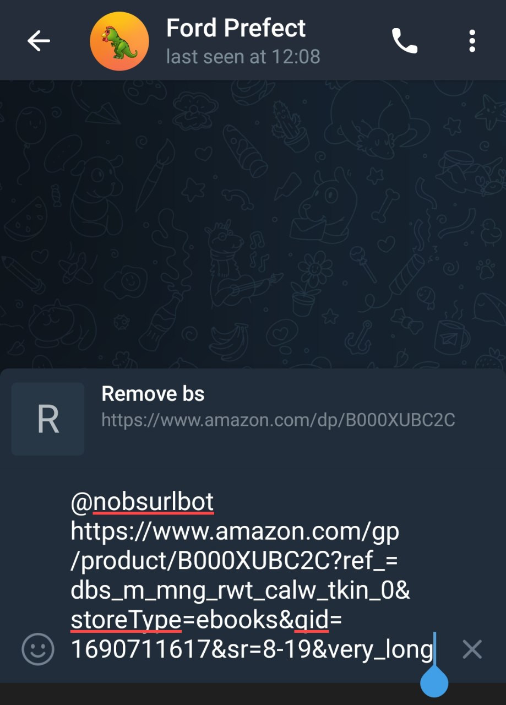
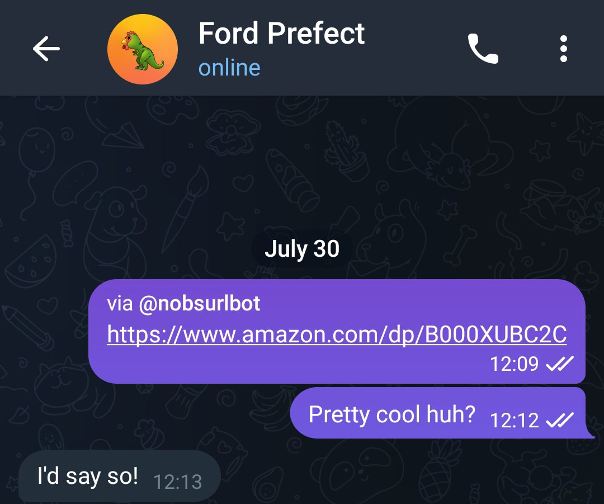

# nobs-url-bot
nobs-url-bot is a Telegram bot for removing bs from URLs, implementing the [nobs-url](https://github.com/sgorblex/nobs-url) library.

<p align="center">

</p>

## Usage
The bot is inline. You can try it at `@nobsurlbot` or host it yourself!

Remove bs from given URL:
```
@nobsurlbot long_supported_url_full_of_useless_parameters
```

Remove bs from given URL and set the text for its link:
```
@nobsurlbot long_supported_url_full_of_useless_parameters link_text
```
